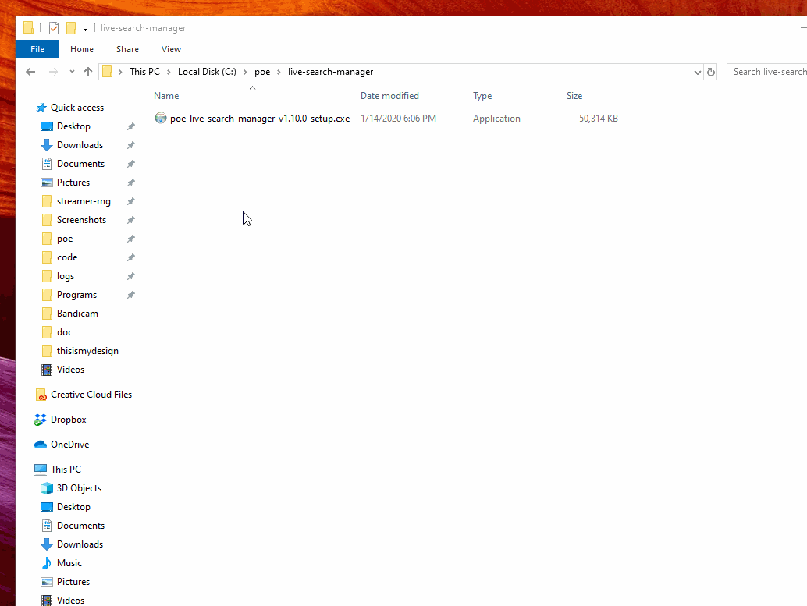

# Poe::Sniper

#### Desktop tool for Path of Exile to make instant offers for listed items without leaving the game.

It is an alternative to keeping several browser tabs open but it consumes far less resources and you don’t need to switch between the game and the browser tabs all the time. You can use custom search criteria and message the seller instantly in-game.

Supported trade sites:
- [pathofexile.com/trade](https://www.pathofexile.com/trade/search/)

[According to GGG](https://www.poe-vault.com/news/2019/05/03/improvements-to-trading-in-path-of-exile-on-pc-are-they-coming), the current form of trading is not going to change. Still, it can be improved. We've been improving it [since Legacy league](https://github.com/5k-mirrors/poe-sniper/releases/tag/v0.1.0). Settle in for simpler, faster, in-game trading.

*You are viewing the README of version [v1.7.0](/../../releases/tag/v1.7.0). This is a completely new app with [pathofexile.com/trade](https://www.pathofexile.com/trade/search/) support and a graphical interface. GitHub is only used to host releases and issues. You can find the old app and other releases [here](/../../releases).*

## Usage

[Click here for full size](https://i.imgur.com/wn8kSQD.gifv)

## Features

- ToS compliant, not breaking any rules
- Queries new listings instantly via live mode
- Handles any custom search
- Uses Windows notifications which:
  - don't remove focus from the game
  - are easily dismissable anytime
- Places whisper message on clipboard for faster interaction
- Consumes far less resources than running browser tabs
- Queues notifications if there are multiple ones

## Installation

- Download and run the latest [release](https://github.com/5k-mirrors/poe-sniper/releases).
- Windows sometimes warns you about installing unsigned apps. If prompted, click `More info` and `Run anyway`.
- The app will install and start.
- A destop shortcut is created and updates are installed on app start.
- Enjoy!

*If you encounter an issue, [report it](/../../issues/new). Restarting the app can help resolve it.*

#### Notifications not showing up?

- Make sure Path of Exile runs in Windowed mode
- See if the "Test notification" on the Settings screen works. If it does, it's most likely an issue with Windows notification settings.
- Turn off "Focus assist" or add PoE Sniper to priority apps
- Turn on "Get notifications from apps and other senders" in Notification settings
- Turn on notifications for PoE Sniper in Notification settings
- Enable notification sound in Sound settings
- Search for further notification settings according to your Windows version

#### Notification settings

- Windows allows you to [change or turn off notification sounds](https://www.google.com/search?q=windows+notification+sound)
- Windows allows you to [change notification length](https://www.google.com/search?q=windows+notification+length). This is _not_ supported currently. Changing it from the default 5 seconds will cause the clipboard to be out of sync with the notifications.

## Caveats

- PoE needs to run in windowed or windowed fullscreen mode for the notifications to show while in-game
- Your clipboard will be altered with every new whisper message (can be turned off)

## Contributing

Bug reports are welcome on GitHub at https://github.com/5k-mirrors/poe-sniper.
